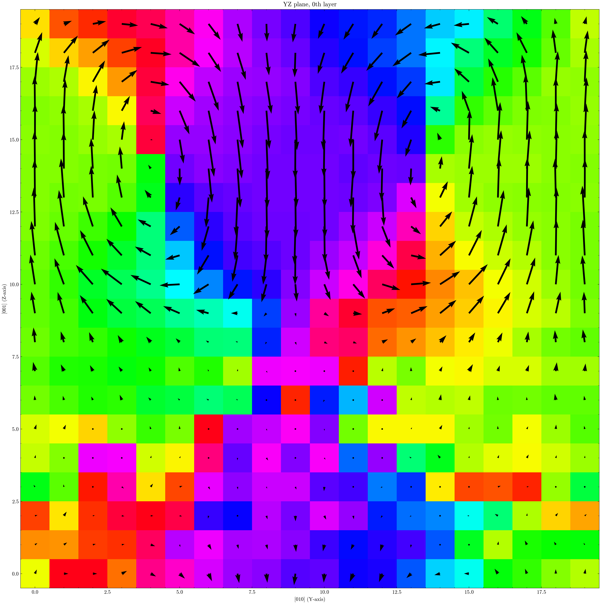
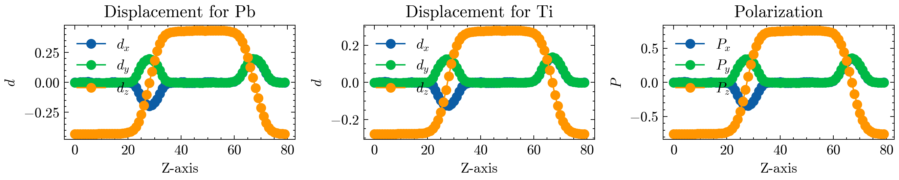

# ferrodispcalc

Utilities for preprocessing and postprocessing molecular simulations of ferroelectric materials.

## Purpose
-------
`ferrodispcalc` provides small, focused tools to compute ionic displacements, polarization and octahedral tilts for perovskite-like materials, and to visualize results efficiently.

## Highlights
----------
- Build neighbor list with easy-to-use API.
- Compute ionic displacements from trajectories / single structure.
- Compute polarization and octahedral-tilt descriptors for perovskite-type structures.
- On-demand visualization helpers for common plots.
- LAMMPS plugin for efficient, in-situ calculations during MD runs.

## Gallery
-------
### The local polarization of (PbTiO<sub>3</sub>)/(SrTiO<sub>3</sub>) superlattice in real space.

<div align=center>  

</div>

__Path:__ `./gallery/PTO-STO-superlattice/plot.py` 

### Profile of Head-to-head charged 180-degree domain wall in PbTiO<sub>3</sub>

<div align=center>  

</div>

__Path:__ `./gallery/PTO-HH-DW/plot.py` 


## Documentation
-------------
More detailed information, example usage, and API docs: 
https://moseyqaq.github.io/ferrodispcalc/

## Install
-------
```bash
git clone https://github.com/MoseyQAQ/ferrodispcalc.git
cd ferrodispcalc
pip install -e .
```

We plan to publish this package to PyPI soon.

## Credit

Please cite this repo if it helps your research. Thanks!

## Papers used this package
1. GPUMDkit (submitted soon)
2. Disentangling the Discrepancy Between Theoretical and Experimental Curie Temperatures in Ferroelectric PbTiO (under review @ MRS Comm.), arXiv:2601.13125 (2026) (perovskite system)
3. Phys. Rev. Lett. 136, 016801 (2026) (organic-inorganic hybrid system)
4. J. Phys. Chem. C 129, 21538 (2025) (perovskite system)
5. Dipolar Nematic State in Relaxor Ferroelectrics (under review @ PRX),arXiv:2509.01464 (2025) (perovskite system)
6. Phys. Rev. X 15, 021042 (2025) (HfO2 system)
